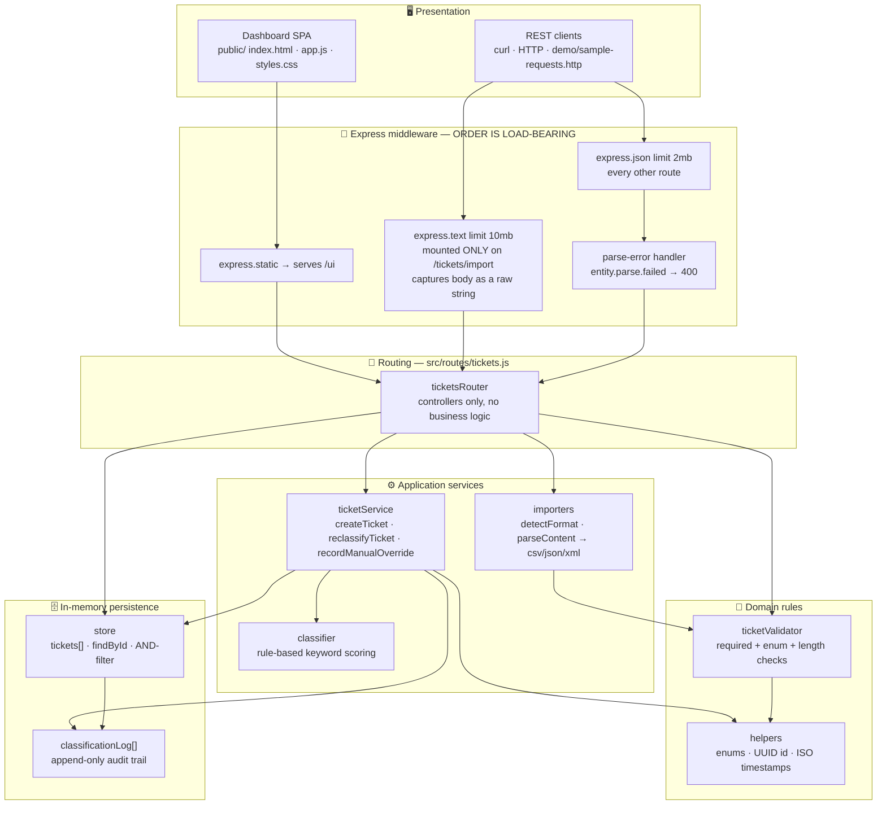
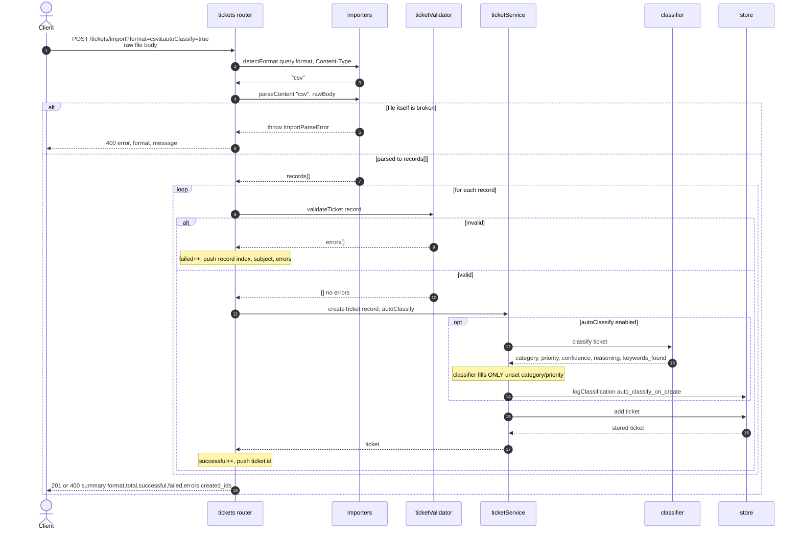
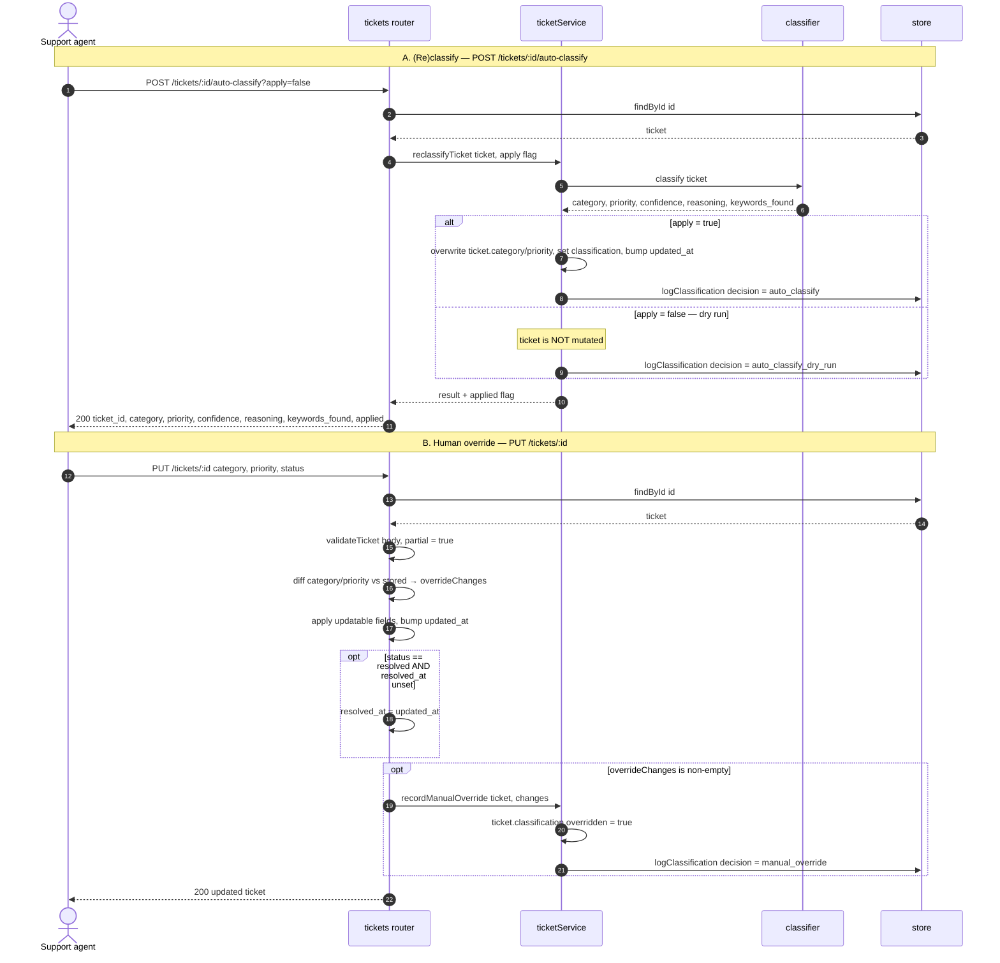

# 🏗️ Architecture — Intelligent Customer Support System

> **Audience**: technical leads reviewing structure, boundaries, and trade-offs.
> **Author**: Andrii Melnyk (`@melnykandria-ops`) · **Date**: 2026-07-07
> **Stack**: Node.js 20 · Express 4 · in-memory store (no DB) · `csv-parse` · `fast-xml-parser`

---

## 📋 Overview

The service is a single-process REST API with a bundled static dashboard. It ingests
support tickets one-at-a-time or in bulk (CSV / JSON / XML), optionally auto-classifies
them with a rule-based engine, and keeps an append-only audit trail of every
classification decision. There is no database — state lives in module-level arrays and
resets on restart.

The codebase is deliberately layered so each concern is testable in isolation:

| Layer | Responsibility | Knows about |
| --- | --- | --- |
| Presentation | Dashboard SPA + HTTP clients | JSON over HTTP only |
| Middleware | Body capture, size limits, parse-error shaping | Express internals |
| Routes | HTTP ↔ service translation, status codes | services + validator + store |
| Services | Business logic: create, classify, import, override | domain rules + store |
| Domain | Field/enum validation, shared constants | nothing (pure) |
| Persistence | In-memory arrays + audit log + filtering | nothing (pure data) |

Routes contain no business rules and services contain no HTTP concepts, so the classifier
and importers can be unit-tested without an HTTP layer, and the routes can be exercised
end-to-end with `supertest`.

---

## 🗺️ High-Level Architecture



---

## 🔀 Request Lifecycle and Middleware Ordering

The single most important structural decision lives in `src/index.js`: **`express.text` is
mounted on `/tickets/import` *before* the global `express.json` parser.**

```js
// src/index.js
app.use('/tickets/import', express.text({ type: () => true, limit: '10mb' }));
app.use(express.json({ limit: '2mb' }));
```

Why the order matters:

- The import endpoint receives a **raw file** (CSV, JSON, or XML) that our own importers
  must parse. If `express.json` ran first, a JSON upload would arrive at the handler
  **already parsed into an object**, defeating format auto-detection and breaking the
  uniform "raw string in → records out" contract shared by all three importers.
- `type: () => true` forces `express.text` to capture the body **regardless of
  Content-Type**, so `?format=csv` works even when a client sends
  `Content-Type: application/json`.
- Because middleware is path-scoped, every *other* route still gets normal JSON parsing.
- A dedicated error middleware catches `entity.parse.failed` and returns a clean
  `400 {"error":"Invalid JSON body"}` instead of an HTML stack trace.
- Two distinct limits reflect two distinct payload profiles: **10 MB** for bulk import
  files, **2 MB** for a single JSON ticket.

Requests then flow: middleware → `ticketsRouter` (validation + status codes) → services
(business logic) → `store` (persistence + audit). A trailing 404 handler and a defensive
500 handler bracket the router.

---

## 🔁 Sequence Diagrams

### 1. Bulk import — per-record validation with optional auto-classification

`POST /tickets/import?format=csv|json|xml[&autoClassify=true]`. The whole file is parsed
once; then **each record is validated independently** so one bad row never sinks the
batch. The response is a summary, and the HTTP status is `201` if at least one ticket was
created, otherwise `400`.



### 2. Auto-classification decision flow — dry-run, apply, and human override

Two related paths share the same classifier and the same audit log. **A** re-runs
classification on an existing ticket (with a `?apply=false` dry-run mode); **B** is a human
overriding the machine via `PUT`. Every branch writes an audit entry with a distinct
`decision` tag.



---

## 🧩 Component Reference

### `src/index.js` — Application bootstrap
Wires the Express app: static `/ui` mount, the **raw-text-before-json** middleware pair,
the JSON parse-error handler, the `/` health endpoint (name, status, endpoint list), the
`ticketsRouter` mount, and terminal 404 / 500 handlers. Exports the `app` (started only
when run directly) so tests import it without opening a socket.

### `src/routes/tickets.js` — HTTP controllers
The full REST surface. Each handler validates input, calls exactly one service or store
method, and maps the result to a status code. It owns no business rules. Endpoints:
`POST /tickets` (`?autoClassify=true` or body `auto_classify:true`), `POST /tickets/import`,
`GET /tickets` (nine combinable filters), `GET /tickets/:id`, `PUT /tickets/:id`,
`DELETE /tickets/:id`, `POST /tickets/:id/auto-classify` (`?apply=false` dry-run),
`GET /tickets/:id/classification-log`. Notable local logic: the `flag()` truthiness helper
(`true`/`"true"`/`"1"`), the override-diff on `PUT`, and the `status:"resolved"` →
`resolved_at` stamp.

### `src/validators/ticketValidator.js` — Payload validation
Pure function `validateTicket(body, { partial })` returning an array of
`{ field, message }` objects (empty = valid). Enforces required fields on create
(`customer_id`, `customer_email`, `subject`, `description ≥ 10 chars`), enum membership for
`category`/`priority`/`status`/`metadata.source`/`metadata.device_type`, length caps
(subject ≤ 200, description ≤ 2000), and array-of-strings `tags`. `partial:true` (used by
`PUT`) validates only the fields present. No HTTP, no side effects — trivially unit-tested.

### `src/services/ticketService.js` — Ticket lifecycle orchestration
The business core. `createTicket` builds the canonical ticket record (server-assigned
`id`, timestamps, defaulted enums, normalized `metadata`) and, when `autoClassify` is on,
runs the classifier **filling only gaps** — an explicitly supplied `category`/`priority`
always wins, and the `applied:{category,priority}` map records which fields the machine
actually set. `reclassifyTicket` re-runs classification with an `apply` switch (dry-run
skips mutation). `recordManualOverride` flips `classification.overridden = true` and logs
the human decision. All three write to the audit log.

### `src/services/classifier.js` — Rule-based classifier
Pure `classify({ subject, description })`. Lower-cases `subject + description`, scores each
category by keyword hits where **multi-word phrases weigh more** (`weightOf` = word count),
and picks the highest score (ties → first-defined category; no hits → `other`). Priority
uses **ordered** rules `urgent > high > low`, defaulting to `medium`. Confidence is `0.3`
when nothing matched, else `min(0.95, 0.5 + 0.1 × score)`. Returns `category`, `priority`,
`confidence`, human-readable `reasoning`, and the exact `keywords_found` — everything needed
to explain a decision.

### `src/services/importers/` — Multi-format import
- **`index.js`** — `detectFormat` (explicit `?format=` wins, else Content-Type sniff) and
  `parseContent`, which rejects empty bodies and dispatches to the right parser. Re-exports
  `SUPPORTED_FORMATS` and `ImportParseError`.
- **`common.js`** — `ImportParseError` (the "file is broken" error, distinct from
  per-record validation), `splitTags` (pipe-separated → array), `buildMetadata`
  (omits absent keys so defaults apply downstream).
- **`csv.js`** — `csv-parse/sync` with `columns`, `trim`, `bom`; maps flat rows to ticket
  records, coercing blank cells to `undefined`.
- **`json.js`** — accepts a top-level array **or** `{ "tickets": [...] }`; rejects
  malformed JSON, empty arrays, and non-object records.
- **`xml.js`** — validates with `XMLValidator`, then parses `<tickets><ticket>…`, forcing
  `<ticket>` and `<tag>` to arrays and keeping values as strings for the validator to judge.

Every importer's job ends at "array of raw records"; validation and persistence happen
later, uniformly, per record.

### `src/store.js` — In-memory store and audit log
Two module-level arrays: `tickets` and `classificationLog`. Provides `add`, `all`
(newest-first), `findById`, `remove`, `logClassification`, `getClassificationLog`, and
`reset` (tests + seed). `filter(f)` applies **AND semantics** across all nine optional
filters — `status`, `category`, `priority`, `customer_id`, `assigned_to`, `source` (nested
in metadata), `tag` (membership), `q` (substring over subject+description), and a `from`/`to`
date range where a date-only `to` expands to end-of-day. It is a linear scan over the array.

### `src/utils/helpers.js` — Shared constants and utilities
The single source of truth for enums (`CATEGORIES`, `PRIORITIES`, `STATUSES`, `SOURCES`,
`DEVICE_TYPES`), the pragmatic `EMAIL_PATTERN`, `generateId` (`crypto.randomUUID`), and
`nowISO`. Imported by both the validator and the services so the vocabulary can never drift.

### `public/` — Dashboard frontend
A no-build, vanilla JS + CSS single-page dashboard in a gr8.tech-inspired dark theme:
stat tiles, category/priority bar charts, the nine filters, a ticket table, a detail drawer
(auto-classify, dry-run, override, resolve, delete), a create-ticket modal, a bulk-import
modal, and toasts. It talks to the same REST API and HTML-escapes every value with a local
`esc()` helper before injecting it into the DOM.

---

## ⚖️ Design Decisions and Trade-offs

| Decision | Chosen approach | Alternative | Rationale / trade-off |
| --- | --- | --- | --- |
| **Persistence** | In-memory arrays, reset on restart | SQL/NoSQL database | Zero setup, instant tests, deterministic fixtures — matches a homework scope. **Cost**: no durability, single-process only, O(n) reads. Boundary is clean, so swapping in a repository is localized to `store.js`. |
| **Classifier** | Rule-based keyword scoring | LLM / ML model | Deterministic, offline, instant (~0.08 ms/call), fully explainable via `reasoning` + `keywords_found`, no API key or cost. **Cost**: brittle to phrasing and no semantic understanding — but the service boundary means an LLM could replace `classify()` without touching routes. |
| **Import transport** | Raw request body (`express.text`) | `multipart/form-data` upload | One code path, trivial to test (`supertest` sends a string), no parser dependency, format chosen by `?format=`/Content-Type. **Cost**: no filename/multi-file semantics — irrelevant here. |
| **Middleware order** | `express.text` on `/tickets/import` *before* `express.json` | Global `express.json` first | Keeps import bodies as raw strings so JSON uploads aren't pre-parsed and all three formats share one contract. **Cost**: order is load-bearing and must be documented (it is, above). |
| **Classifier scope on create** | Fills **only** unset `category`/`priority` | Always overwrite | Respects explicit caller intent while still enriching sparse tickets; the `applied` map makes it auditable. **Cost**: a caller that wants forced re-classification must use `POST …/auto-classify`. |
| **`resolved_at` derivation** | Stamped when `status` becomes `resolved` (and only if unset) | Client-supplied timestamp | Server owns lifecycle truth; can't be forged or accidentally cleared on later edits. **Cost**: a ticket re-opened and re-resolved keeps its first resolution time (acceptable for this model). |
| **Audit log** | Separate append-only array keyed by `ticket_id` | Embed history on the ticket | Immutable trail survives ticket mutation and deletion of live fields; four decision tags (`auto_classify_on_create`, `auto_classify`, `auto_classify_dry_run`, `manual_override`) make intent explicit. **Cost**: grows unbounded in memory — fine for the scope, would need retention in production. |

---

## 🔐 Security Considerations

- **Input validation** — Every write path runs `validateTicket` before persistence. On
  import, validation is **per record**, so a malformed row is rejected with a precise
  `{ record, subject, errors }` entry rather than corrupting the batch. Enum fields are
  whitelist-checked against `helpers.js`, so unexpected values never reach the store.
- **Payload limits** — `express.text` caps import bodies at **10 MB** and `express.json`
  caps single-ticket bodies at **2 MB**; oversized requests are rejected by Express before
  a handler runs, bounding memory per request. Malformed JSON is converted to a clean
  `400` instead of leaking a stack trace.
- **Output encoding / XSS** — All ticket content is attacker-controlled free text. The
  dashboard escapes `& < > " '` via `esc()` before writing values into `innerHTML`, so a
  ticket subject like `` renders as inert text. The API itself returns
  JSON with the correct content type, so there is no HTML-injection surface server-side.
- **No authentication (out of scope)** — Every endpoint is unauthenticated and every client
  can read, mutate, and delete any ticket. This is acceptable only for a local homework
  service. **Production would need**: authentication (session or JWT/OAuth) plus
  role-based authorization on write and delete; per-tenant data isolation (tickets are PII —
  emails, names); rate limiting and a request log; CORS locked to known origins; TLS
  termination; and secret management once a real datastore or LLM key is introduced.

---

## 🚀 Performance Considerations

All figures below are **measured on the Jest suite run** (`tests/test_performance.test.js`),
with the enforced limit in parentheses:

| Scenario | Measured | Limit |
| --- | --- | --- |
| 200 sequential `POST /tickets` | **645 ms** | 5000 ms |
| 50-row CSV import | **36 ms** | 2000 ms |
| Combined-filter `GET` over 600 tickets | **4 ms** | 1000 ms |
| 25 concurrent `POST`s | **23 ms** | 3000 ms |
| 1000 `classify()` calls | **80 ms** | 1000 ms |
| 100 auto-classified creates | **298 ms** | 3000 ms |
| 100 `GET`-by-id over 500 tickets | **242 ms** | 2000 ms |

Reading these:

- The classifier is effectively free (~**0.08 ms/call**); auto-classification is not the
  bottleneck on writes.
- **Everything is O(n).** `filter`, `findById`, and `remove` each scan the whole `tickets`
  array, and `all()` sorts a copy on every read. At hundreds-to-low-thousands of tickets
  this is single-digit-to-low-hundreds of milliseconds — well inside the limits — because
  the array lives in-process with no I/O.
- **Where it breaks down**: cost grows linearly with ticket count, and combined operations
  are super-linear (each `filter` call re-sorts via `all()`). The audit log also grows
  unbounded. Beyond roughly **10k–100k tickets**, or once durability/concurrency is
  required, move `store.js` to a real datastore and add indexes on the hot filter columns
  (`status`, `category`, `priority`, `customer_id`, `assigned_to`) plus a full-text index
  for the `q` search. Because persistence is already isolated behind the store's function
  interface, that migration touches one module and leaves routes and services untouched.
