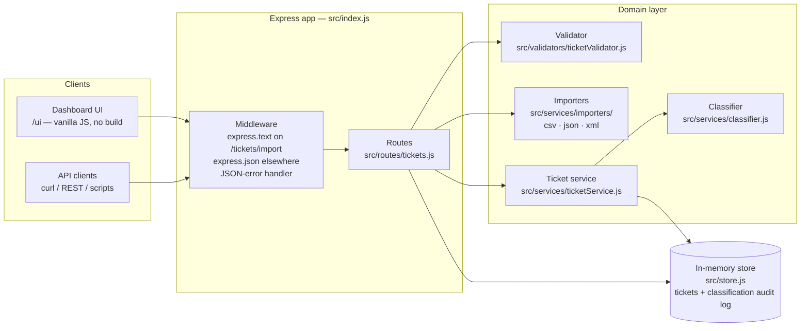
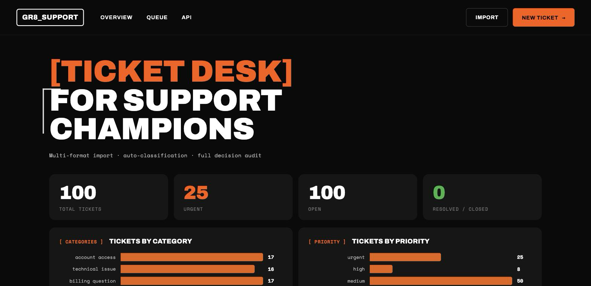
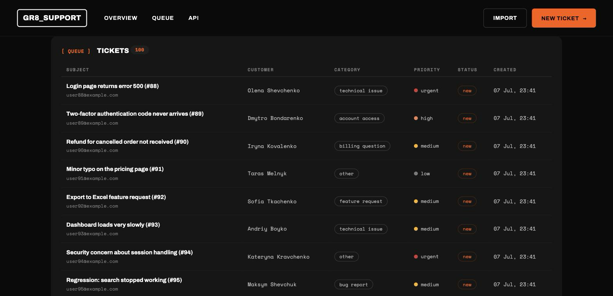
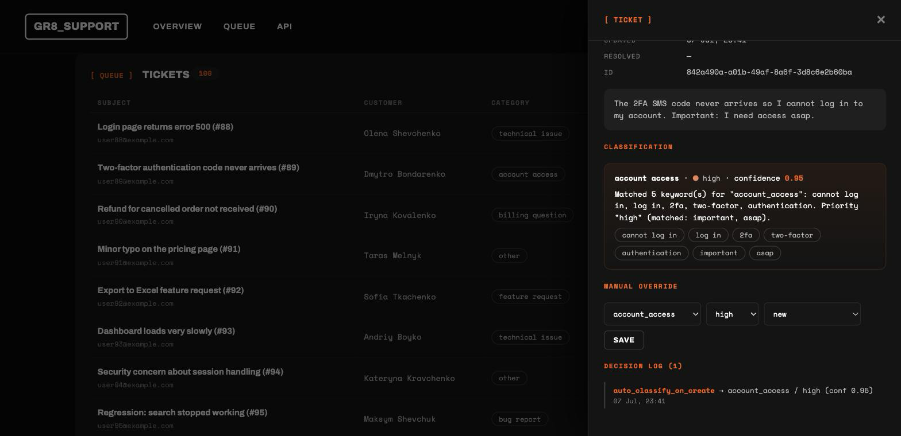
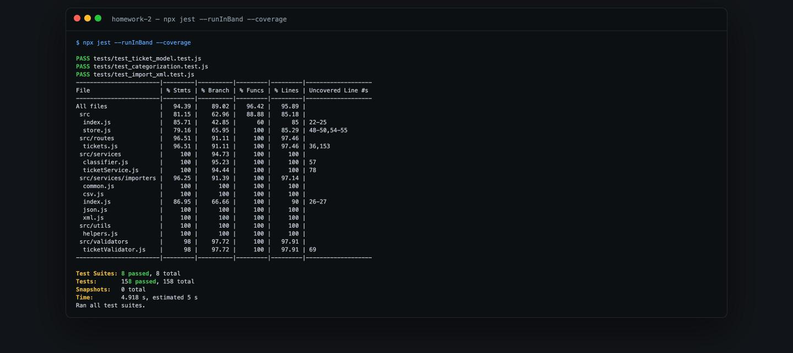
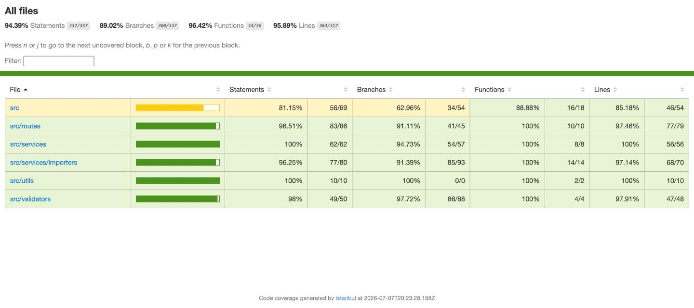
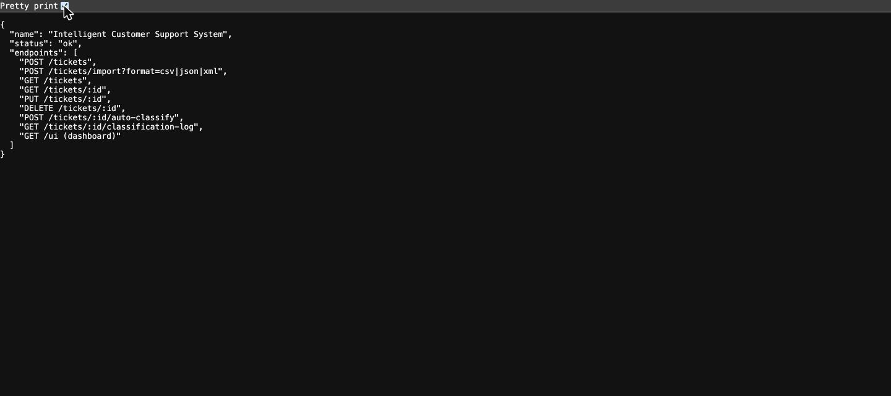
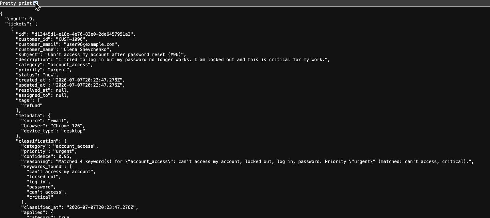
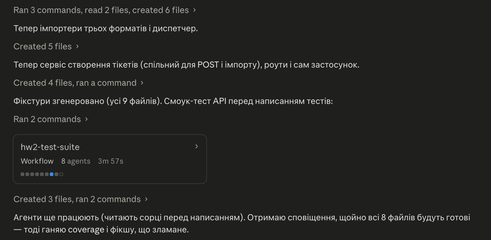

# 🎧 Intelligent Customer Support System

> **Student Name**: Andrii Melnyk ([@melnykandria-ops](https://github.com/melnykandria-ops))
> **Date Submitted**: 2026-07-07
> **AI Tools Used**: Claude Code (multi-model: Fable 5, Opus 4.8, Sonnet 5, Haiku 4.5)

---

## 📋 Project Overview

A customer support ticket management REST API with **multi-format bulk import** (CSV / JSON / XML), **rule-based auto-classification** (category + priority with confidence score, reasoning and a full audit log), and a **zero-build dashboard UI**. Built for Homework 2 of the *GenAI & Agentic AI for Software Engineering* course.

**Stack:** Node.js 20 · Express 4 · in-memory store (no database) · `csv-parse` + `fast-xml-parser` · Jest 29 + Supertest 7.

### ✅ Tasks 1–5 Checklist

- [x] **Task 1 — Multi-Format Ticket Import API**: full CRUD (`POST/GET/PUT/DELETE /tickets`), bulk import from CSV/JSON/XML with per-record validation and an import summary (`total` / `successful` / `failed` / `errors` / `created_ids`), graceful 400s for malformed files, correct status codes (201/400/404/204).
- [x] **Task 2 — Auto-Classification**: keyword-scored categories, ordered priority rules (urgent > high > low > medium default), confidence 0–1, human-readable reasoning, `keywords_found`; optional auto-run on create (`?autoClassify=true`), dry-run mode (`?apply=false`), manual override detection on `PUT`, and every decision logged to `GET /tickets/:id/classification-log`.
- [x] **Task 3 — AI-Generated Test Suite**: **158 tests in 8 suites, all passing**; coverage **94.36% statements / 89.02% branches / 96.42% functions / 95.87% lines** (85% threshold enforced in `package.json`).
- [x] **Task 4 — Multi-Level Documentation**: 5 docs, each written by a *different* Claude model (see [How AI Was Used](#-how-ai-was-used)), with Mermaid diagrams throughout.
- [x] **Task 5 — Integration & Performance Tests**: full ticket lifecycle, bulk import + classification verification, 25 concurrent requests, combined category+priority filtering, and 7 timed benchmarks.

### ✨ Feature Highlights

- **Filters that combine (AND semantics)**: `status`, `category`, `priority`, `customer_id`, `assigned_to`, `source`, `tag`, `q` (text search), `from`, `to` — all on `GET /tickets`.
- **Format auto-detection** on import: explicit `?format=csv|json|xml` wins, otherwise the `Content-Type` header is used.
- **Classifier only fills gaps on create**: an explicitly provided `category`/`priority` always beats the auto-classifier; re-classify later with `POST /tickets/:id/auto-classify`.
- **Dashboard UI at `/ui`** (vanilla JS + CSS, gr8.tech-inspired dark style, no build step): stat tiles, category/priority bar charts, filters, ticket table, detail drawer (auto-classify / dry-run / override / resolve / delete), create-ticket modal, bulk-import modal, toasts.

---

## 🏗 Architecture Diagram



**Request flow:** a raw body hits the middleware (import bodies stay as text, everything else is parsed as JSON) → the router validates via `ticketValidator`, parses import files via the format-specific importer, then delegates creation/re-classification to `ticketService`, which calls `classifier.classify()` and persists both the ticket and an audit-log entry in `store`.

---

## 🚀 Installation & Setup

**Prerequisites:** Node.js 20+ (uses built-in `fetch` in scripts and `node --watch` for dev).

```bash
# 1. Install
cd homework-2
npm install

# 2. Start the API (http://localhost:3000)
npm start          # or: npm run dev  (auto-restart on change)

# 3. Optional: seed 100 sample tickets (3 fixture files, auto-classified)
npm run seed       # API must already be running

# 4. Open the dashboard
open http://localhost:3000/ui
```

Alternatively: `./demo/run.sh` installs deps (if needed) and starts the server. Ready-made requests live in `demo/sample-requests.http` (VS Code REST Client / Postman).

### Quick smoke test

```bash
curl -s -X POST 'http://localhost:3000/tickets?autoClassify=true' \
  -H 'Content-Type: application/json' \
  -d '{
    "customer_id": "CUST-1001",
    "customer_email": "olena@example.com",
    "subject": "Cannot log in after password reset",
    "description": "I reset my password but now I am locked out of my account. This is critical for my work."
  }'
```

Returns `201` with the stored ticket — the classifier fills `"category": "account_access"`, `"priority": "urgent"` and attaches a `classification` object (`confidence`, `reasoning`, `keywords_found`, `applied`, `overridden`).

### Endpoint map

| Method | Endpoint | Purpose |
|--------|----------|---------|
| `GET` | `/` | Health check + endpoint list |
| `POST` | `/tickets` | Create a ticket (`?autoClassify=true` optional) |
| `POST` | `/tickets/import` | Bulk import raw CSV/JSON/XML body (`?format=`, `?autoClassify=true`) |
| `GET` | `/tickets` | List with combinable filters |
| `GET` | `/tickets/:id` | Get one ticket |
| `PUT` | `/tickets/:id` | Update; manual category/priority changes are audit-logged as overrides |
| `DELETE` | `/tickets/:id` | Delete (204) |
| `POST` | `/tickets/:id/auto-classify` | (Re)classify; `?apply=false` = dry-run |
| `GET` | `/tickets/:id/classification-log` | Audit trail of every classification decision |
| `GET` | `/ui` | Dashboard frontend |

Full request/response documentation: [`docs/API_REFERENCE.md`](docs/API_REFERENCE.md).

---

## 🧪 Running Tests

```bash
npm test                # 158 tests in 8 suites (jest --runInBand)
npm run test:coverage   # same + coverage report (fails below the 85% threshold)
npm run fixtures        # regenerate the deterministic sample/invalid/malformed fixtures
```

### Coverage (measured, threshold 85% enforced in `package.json`)

| Metric | Coverage |
|--------|----------|
| Statements | **94.36%** |
| Branches | **89.02%** |
| Functions | **96.42%** |
| Lines | **95.87%** |

### Test suites

| Suite | Focus |
|-------|-------|
| `test_ticket_api` | CRUD endpoints, status codes, filtering |
| `test_ticket_model` | Field validation: email, lengths, enums, tags, metadata |
| `test_import_csv` | 50-row fixture, invalid rows, malformed CSV |
| `test_import_json` | 20-record fixture, invalid records, malformed JSON |
| `test_import_xml` | 30-record fixture, invalid records, malformed XML |
| `test_categorization` | Category scoring, priority rules, confidence, audit log |
| `test_integration` | Lifecycle workflows, import + classification, 25 concurrent POSTs, combined filters |
| `test_performance` | 7 timed benchmarks (all well under their limits) |

Sample benchmark results from the suite run: 200 sequential `POST /tickets` in **645 ms** (limit 5000), 50-row CSV import in **36 ms** (2000), combined-filter `GET` over 600 tickets in **4 ms** (1000), 1000 `classify()` calls in **80 ms** (1000). Full table and methodology: [`docs/TESTING_GUIDE.md`](docs/TESTING_GUIDE.md).

---

## 📁 Project Structure

```
homework-2/
├── src/
│   ├── index.js                     # Express app: middleware, health, /ui static, error handling
│   ├── store.js                     # In-memory tickets + classification audit log
│   ├── routes/
│   │   └── tickets.js               # All /tickets routes (CRUD, import, classify, log)
│   ├── services/
│   │   ├── ticketService.js         # create / reclassify / manual-override + audit logging
│   │   ├── classifier.js            # Rule-based keyword scoring, confidence, reasoning
│   │   └── importers/
│   │       ├── index.js             # Format detection + dispatch
│   │       ├── csv.js  json.js  xml.js
│   │       └── common.js            # ImportParseError, shared record normalization
│   ├── validators/
│   │   └── ticketValidator.js       # Create + partial (PUT) validation
│   └── utils/
│       └── helpers.js               # Enums, email pattern, id/timestamp helpers
├── tests/
│   ├── test_*.test.js               # 8 suites / 158 tests
│   └── fixtures/                    # sample_tickets.{csv,json,xml} (50/20/30),
│                                    # invalid_tickets.* and malformed.* for negative tests
├── public/                          # Dashboard UI: index.html, styles.css, app.js (no build step)
├── demo/
│   ├── run.sh                       # One-command install + start
│   └── sample-requests.http         # Ready-made requests for every endpoint
├── scripts/
│   ├── generate-fixtures.js         # npm run fixtures — deterministic sample data
│   └── seed.js                      # npm run seed — imports all 3 sample files with autoClassify
├── docs/
│   ├── API_REFERENCE.md  ARCHITECTURE.md  TESTING_GUIDE.md  HOWTORUN.md
│   └── screenshots/                 # UI + coverage screenshots
├── TASKS.md                         # Assignment brief
└── package.json                     # Scripts + jest config (85% coverage threshold)
```

---

## 🤖 How AI Was Used

The entire project was built with **Claude Code** using a three-phase workflow:

1. **Scaffold** — Claude Code designed and implemented the API, classifier, importers, validator, store, fixtures generator and dashboard UI from the `TASKS.md` brief.
2. **AI-written tests via parallel subagents** — the **8 test files were generated by 8 parallel AI agents**, one suite per agent, each working against the real source code.
3. **Verification** — every generated suite was then verified by actually running it: `npm run test:coverage` confirms **158/158 tests pass** and coverage clears the enforced 85% threshold on all four metrics.

### Multi-model documentation (Task 4)

Each documentation file was written by a **different Claude model**, per the assignment requirement:

| Document | Audience | Written by |
|----------|----------|------------|
| `README.md` (this file) | Developers | **Fable 5** |
| `docs/API_REFERENCE.md` | API consumers | **Haiku 4.5** |
| `docs/ARCHITECTURE.md` | Technical leads | **Opus 4.8** |
| `docs/TESTING_GUIDE.md` | QA engineers | **Sonnet 5** |
| `docs/HOWTORUN.md` | Anyone running the project | **Haiku 4.5** |

---

## 🖼 Screenshots

### Frontend (GR8-style dashboard at `/ui`)

**Dashboard** — stat tiles, category/priority charts, filters and ticket table:



**Ticket queue** — auto-classified categories, priority badges, statuses:



**Ticket detail drawer** — classification card (confidence + keywords), manual override, decision log:



### Raw backend (no frontend)

**Test suite run** — 8 suites, 158 tests, coverage table straight from `npx jest --coverage`:



**Test coverage report** — all metrics above the 85% threshold:



**Health endpoint** (`GET /`) and **combined filter** (`GET /tickets?category=account_access&priority=urgent`) — raw JSON responses in the browser:





### AI-assisted development

**Claude Code session** — scaffolding the app and dispatching the 8-agent test-writing workflow:



---

## 👤 Author

**Andrii Melnyk** ([@melnykandria-ops](https://github.com/melnykandria-ops))
*GenAI & Agentic AI for Software Engineering — Homework 2 · 2026-07-07*

<div align="center">

*This project was completed as part of the AI-Assisted Development course.*

</div>
