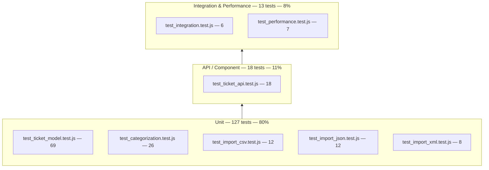

# 🧪 Testing Guide

Everything a QA engineer needs to run, extend, and manually verify the test suite for the Intelligent Customer Support System.

---

## 📐 Test Pyramid

158 tests across 8 suites, organized in three layers. The base (model, classifier, importers) is unit-level and pure-function heavy; the middle layer drives the Express app end-to-end over HTTP for each route; the top exercises multi-step workflows and throughput.



| Layer | Suites | Tests | What it covers |
|-------|--------|-------|-----------------|
| **Unit** | `test_ticket_model`, `test_categorization`, `test_import_csv`, `test_import_json`, `test_import_xml` | 127 | Validator rules (required fields, enums, string-length boundaries, partial/PUT mode), the `classify()` rule engine (category/priority keyword scoring, confidence, reasoning), and each format-specific importer's parsing/mapping logic |
| **API / Component** | `test_ticket_api` | 18 | Every route in `src/routes/tickets.js` through `supertest` — health check, CRUD, filters, error shapes, 404s |
| **Integration & Performance (e2e)** | `test_integration`, `test_performance` | 13 | Full lifecycles spanning multiple endpoints (create → classify → override → resolve → delete), concurrent requests, bulk-import-then-query, and throughput benchmarks |

Note: `test_categorization` is counted in the unit layer because most of its 26 tests call `classify()` directly as a pure function; four of them additionally drive it through `POST /tickets/:id/auto-classify` and the create-time auto-classify flags, so it also has one foot in the API layer.

---

## ▶️ How to Run

```bash
# Full suite (158 tests, ~4s, runs serially via --runInBand)
npm test

# Full suite + coverage report (terminal table + HTML)
npm run test:coverage

# One suite only
npx jest tests/test_categorization.test.js

# One test by name (any suite)
npx jest tests/test_ticket_api.test.js -t "returns 400 for an invalid customer_email"

# Verbose (per-test ✓ lines instead of the default per-suite summary)
npx jest --verbose
```

All suites `require('../src/index')` directly and drive it with `supertest` — no server process or port needs to be running first. Tests execute with `--runInBand` (see `package.json`) so the shared in-memory store isn't raced across parallel workers.

---

## 📊 Coverage Report

```bash
npm run test:coverage
```

| Metric | Threshold (enforced) | Actual |
|--------|----------------------|--------|
| Statements | 85% | **94.36%** |
| Branches | 85% | **89.02%** |
| Functions | 85% | **96.42%** |
| Lines | 85% | **95.87%** |

The threshold is enforced by Jest's `coverageThreshold.global` block in `package.json` — if any metric drops below 85%, `npm run test:coverage` exits non-zero and fails CI.

The full interactive HTML report (line-by-line highlighting of covered/uncovered branches) is written to:

```
coverage/lcov-report/index.html
```

Open it directly in a browser after running `npm run test:coverage`. The terminal summary is also printed inline per file (statements/branches/functions/lines %, plus uncovered line numbers) so you can spot gaps without opening the HTML report.

---

## 🗂️ Sample Test Data

All fixtures live in `tests/fixtures/` and are generated deterministically by `npm run fixtures` (`scripts/generate-fixtures.js`) — regenerating produces byte-identical output, so fixtures can be safely committed and diffed.

| File | Format | Records | Purpose |
|------|--------|---------|---------|
| `sample_tickets.csv` | CSV | 50 | Happy-path bulk import: quoted fields with embedded commas, pipe-separated `tags`, `source`/`browser`/`device_type` columns, Content-Type auto-detection |
| `sample_tickets.json` | JSON | 20 | Happy-path bulk import: `{ "tickets": [...] }` shape, nested `metadata` object, array `tags` |
| `sample_tickets.xml` | XML | 30 | Happy-path bulk import: `<tickets><ticket>` structure, `<tags><tag>` children, nested `<metadata>` |
| `invalid_tickets.csv` | CSV | 3 | Every row fails a different validation rule (bad email, missing `customer_id`, invalid category/device_type enum) — asserts `failed: 3`, per-record field errors |
| `invalid_tickets.json` | JSON | 3 | Same idea in JSON shape (bad email, empty subject, missing `customer_id`) — asserts `failed: 3` |
| `invalid_tickets.xml` | XML | 2 | Bad email + too-short description — asserts `failed: 2` |
| `malformed.csv` | CSV | — | Unclosed quoted field; `csv-parse` throws → asserts `400` with an `ImportParseError` message, nothing created |
| `malformed.json` | JSON | — | Truncated/invalid JSON syntax; `JSON.parse` throws → asserts `400`, nothing created |
| `malformed.xml` | XML | — | Unclosed tag; fails `fast-xml-parser`'s `XMLValidator.validate` → asserts `400`, nothing created |

Use the `fixture('name.ext')` helper pattern already present in each import test file (reads from `tests/fixtures/` via `fs.readFileSync` + `path.join(__dirname, 'fixtures', name)`) when adding new import test cases — don't inline large CSV/JSON/XML blobs into test files.

---

## ✅ Manual Testing Checklist

Run through this after any change to `src/routes/tickets.js`, `src/services/`, or `public/`. Start the server first: `npm start` (or `npm run dev` for auto-restart), then optionally `npm run seed` to populate the dashboard with 100 sample tickets.

**Core CRUD**
- [ ] `GET /` returns `200` with `name`, `status: "ok"`, and the `endpoints` array
- [ ] `POST /tickets` with a full valid payload returns `201` with a server-generated `id` (UUID), `created_at` == `updated_at`, and defaults `category: "other"`, `priority: "medium"`, `status: "new"`, `classification: null`
- [ ] `POST /tickets` with a payload missing `customer_id`/`customer_email`/`subject`/`description` returns `400` with `{ error: "Validation failed", details: [...] }` listing every missing field
- [ ] `POST /tickets` with an invalid `customer_email` (e.g. `not-an-email`) returns `400` with the field-specific message
- [ ] `GET /tickets/:id` for a just-created ticket returns it exactly; for an unknown id returns `404` with `{ error: "Ticket not found", id }`
- [ ] `PUT /tickets/:id` updates provided fields only, bumps `updated_at`, and leaves `created_at` untouched
- [ ] `PUT /tickets/:id` setting `status: "resolved"` stamps `resolved_at` equal to the new `updated_at`
- [ ] `DELETE /tickets/:id` returns `204` with an empty body; a follow-up `GET` on the same id returns `404`
- [ ] Requesting an undefined route (e.g. `GET /nope`) returns `404` with `{ error: "Not found", path }`

**Auto-classification**
- [ ] `POST /tickets?autoClassify=true` (or body `auto_classify: true`) fills `category`/`priority` from the classifier and populates `classification` with `confidence`, `reasoning`, `keywords_found`
- [ ] `POST /tickets?autoClassify=true` with an explicit `category` or `priority` in the body keeps that value (classifier only fills gaps) but still records the classification result with `applied: { category: false, ... }`
- [ ] `POST /tickets/:id/auto-classify` re-runs the classifier and applies the result to the ticket
- [ ] `POST /tickets/:id/auto-classify?apply=false` returns the same result shape but leaves the ticket's `category`/`priority` unchanged (dry-run)
- [ ] Manually changing `category` or `priority` via `PUT` sets `classification.overridden: true` and appends a `manual_override` entry
- [ ] `GET /tickets/:id/classification-log` returns every decision for that ticket in chronological order (`auto_classify_on_create`, `auto_classify`, `auto_classify_dry_run`, `manual_override`)

**Bulk import — one pass per format**
- [ ] `POST /tickets/import?format=csv` with `tests/fixtures/sample_tickets.csv` returns `201` with `total: 50, successful: 50, failed: 0`
- [ ] `POST /tickets/import?format=json` with `sample_tickets.json` returns `201` with `total: 20, successful: 20, failed: 0`
- [ ] `POST /tickets/import?format=xml` with `sample_tickets.xml` returns `201` with `total: 30, successful: 30, failed: 0`
- [ ] Omitting `?format=` but setting the correct `Content-Type` header (`text/csv` / `application/json` / `application/xml`) auto-detects the format
- [ ] Importing `invalid_tickets.csv` returns `400` (or `201` if partially recoverable) with `failed: 3` and per-record `field`/`message` errors
- [ ] Importing any `malformed.*` fixture returns `400` with `{ error: "Import file could not be parsed", format, message }` and creates nothing
- [ ] `?autoClassify=true` on import classifies every successfully-created ticket, not just one

**Filters (`GET /tickets`)**
- [ ] Single filters work individually: `status`, `category`, `priority`, `customer_id`, `assigned_to`, `source`, `tag`
- [ ] `q=<text>` does a case-insensitive substring match across `subject` + `description`
- [ ] `from`/`to` correctly bound `created_at` (spot-check with a date-only `to` value, e.g. `to=2026-07-07`)
- [ ] Two or more filters combined (e.g. `?status=in_progress&priority=high&tag=vip`) return only tickets matching **all** of them (AND semantics)
- [ ] No matching tickets returns `{ count: 0, tickets: [] }`, not an error

**Dashboard (`/ui`)**
- [ ] Stat tiles (Total / Urgent / Open / Resolved+Closed) update after creating, resolving, or deleting a ticket
- [ ] Category and priority bar charts reflect the current filtered ticket set
- [ ] The filter row (search, category, priority, status, Reset) narrows the table live and updates the `table-count` pill
- [ ] "+ NEW TICKET" modal creates a ticket with the "Auto-classify on create" checkbox both checked and unchecked
- [ ] "IMPORT" modal accepts a pasted CSV/JSON/XML blob (or file upload) and shows the import summary (successful/failed counts) after submit
- [ ] Clicking a table row opens the detail drawer showing full ticket fields, classification block, and the decision log
- [ ] Drawer "RUN AUTO-CLASSIFY" applies a new classification and refreshes the drawer's classification section
- [ ] Drawer dry-run action shows a proposed result without changing the ticket's stored `category`/`priority`
- [ ] Drawer manual override (editing `category`/`priority` directly) is reflected immediately and appears in the decision log as `manual_override`
- [ ] Drawer "RESOLVE" button (visible only when `status !== "resolved"`) sets status to resolved and stamps `resolved_at`
- [ ] Drawer "DELETE" removes the ticket, closes the drawer, and the table/stat tiles update without a manual page refresh
- [ ] A toast notification appears after each drawer action (resolve / delete / classify) and after create/import

---

## ⏱️ Performance Benchmarks

All benchmarks live in `tests/test_performance.test.js`. They use generous thresholds by design — they exist to catch order-of-magnitude regressions (e.g. an accidental O(n²) filter or sync I/O in a request handler), not to enforce tight SLAs. Each run prints a `console.table` summary of actual durations under `[perf]` log lines.

| Benchmark | Measured | Threshold | Margin |
|-----------|---------:|----------:|--------|
| 200 sequential `POST /tickets` | 645 ms | 5000 ms | 7.8× headroom |
| 50-row CSV bulk import | 36 ms | 2000 ms | 55× headroom |
| Combined-filter `GET` over 600 seeded tickets | 4 ms | 1000 ms | 250× headroom |
| 25 concurrent `POST /tickets` | 23 ms | 3000 ms | 130× headroom |
| 1000 `classify()` calls (pure function) | 80 ms | 1000 ms | 12.5× headroom |
| 100 auto-classified creates (`?autoClassify=true`) | 298 ms | 3000 ms | 10× headroom |
| 100 `GET /tickets/:id` over a 500-ticket store | 242 ms | 2000 ms | 8.3× headroom |

If a benchmark starts failing (duration approaching or exceeding threshold), treat it as a regression signal first — check for newly-introduced synchronous work in the hot path (e.g. `store.all()` re-sorting on every filter call, or a classifier keyword list that grew large) before simply raising the threshold.

---

## ➕ How to Add a New Test

1. **Pick the right file** — extend an existing suite if it fits (e.g. a new validator rule → `test_ticket_model.test.js`; a new classifier keyword → `test_categorization.test.js`); create a new `tests/test_<topic>.test.js` file only for a genuinely new subsystem.
2. **Import the app, not a server** — `const app = require('../src/index'); const request = require('supertest');` — never call `app.listen()` in a test; `supertest` drives the Express app in-process.
3. **Reset the store in `beforeEach`** — the ticket store and classification log are in-memory module singletons shared across tests, so every suite must start clean:
   ```js
   const store = require('../src/store');
   beforeEach(() => store.reset());
   ```
4. **Use `tests/fixtures/` for file-based data** — read fixtures with `fs.readFileSync(path.join(__dirname, 'fixtures', 'sample_tickets.csv'), 'utf8')` rather than inlining large CSV/JSON/XML strings; add new fixtures via `scripts/generate-fixtures.js` if you need new deterministic sample data, then run `npm run fixtures` to regenerate.
5. **Assert on both status and body shape** — check `res.status` first, then the exact response shape (`res.body.error`, `res.body.details`, etc.) rather than partial/loose assertions, so a shape regression fails loudly.
6. **For classifier tests**, call `classify({ subject, description })` directly (no HTTP round-trip needed) and assert on `category`, `priority`, `confidence`, `reasoning`, and `keywords_found`.
7. **For new endpoints or filters**, add the case to `test_ticket_api.test.js` (or `test_categorization.test.js` for classification-adjacent routes) and consider whether it also needs a multi-step scenario in `test_integration.test.js`.
8. **Run the targeted suite while iterating**, then the full suite with coverage before committing:
   ```bash
   npx jest tests/test_<your_file>.test.js --verbose
   npm run test:coverage
   ```
9. **Check the coverage delta** — if your change touches `src/`, confirm `coverage/lcov-report/index.html` shows the new lines/branches as covered, not just that the global percentage still clears 85%.
