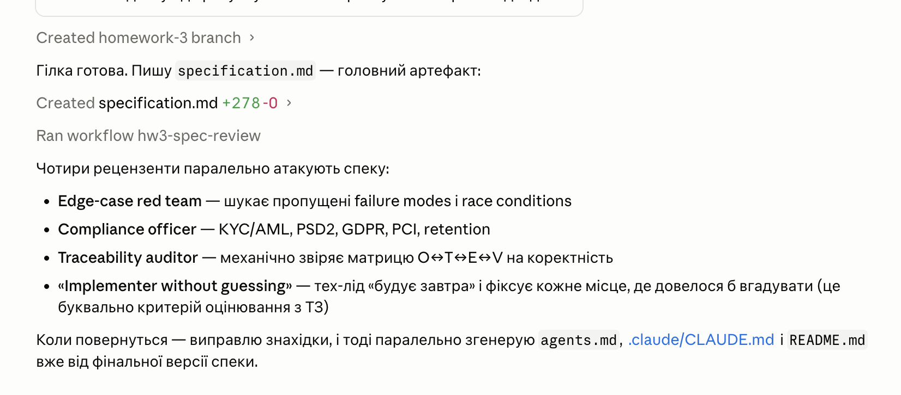
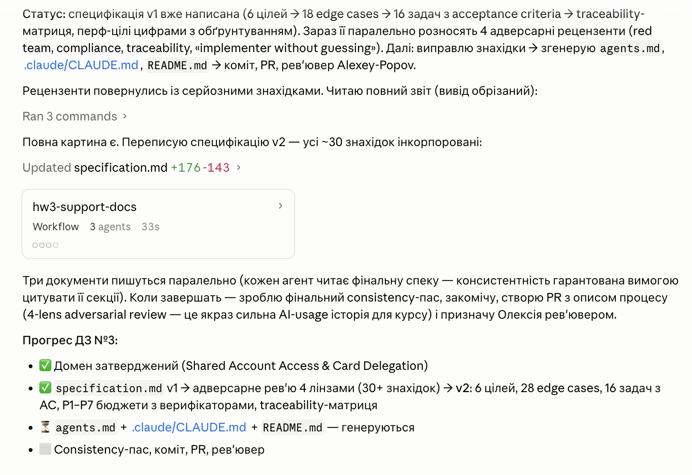

# Homework 3 — Specification-Driven Design: Rationale

> **Student Name:** Andrii Melnyk ([@melnykandria-ops](https://github.com/melnykandria-ops))
> **Date:** 2026-07-22 *(submitted after the 16.07 deadline — see note in the PR)*
> **AI Tools:** Claude Code (spec drafting + 4-lens adversarial review workflow)

## 1. Task summary

A specification-only package for **Shared Account Access & Card Delegation** in a regulated retail neobank: an account Owner grants a Delegate scoped access, including a delegated virtual card with per-delegate limits, and either party can end the arrangement instantly. No code, per the assignment — the deliverables are `specification.md` (the layered spec), `agents.md` (agent guidelines), `.claude/CLAUDE.md` (editor/AI rules), and this `README.md` (rationale).

## 2. Why this domain

Deliberately **not** the suggested single-user virtual-card example. Delegation keeps the whole card lifecycle (issue, freeze, limits, transactions) and adds dimensions the single-user version never exercises:

| Added dimension | Where it bites in the spec |
|---|---|
| Two-actor permission model (Owner ≠ Delegate, plus ops/compliance/fraud) | §2 actor tables, T5 authz matrix, SCA asymmetry §4.2 |
| Concurrency on **shared** limits | T8 reservation engine, E3 exactly-one-winner race |
| Revocation semantics with money in flight | E5/E6/E20, P2 propagation budget, T10 |
| Co-user privacy (two customers, one account) | O6, per-tier visibility, KYC data walls |
| Consent lifecycle: grant, disclosure, withdrawal, re-consent | T2, E23, E28 |

Same document budget, materially richer edge-case and compliance surface — 28 edge-case rows, most of which have no analogue in a one-user feature.

## 3. Rationale — why the spec is structured this way

### 3.1 Layering and traceability

The spec follows the assignment's layer table exactly: high-level objective → observable mid-level objectives (O1–O6) → NFR/policy (§4) → implementation guardrails (§5) → beginning/ending context (§8) → 16 low-level tasks with acceptance criteria (§9). The **traceability matrix (§10) is the enforcement mechanism**, not decoration: every task maps to ≥ 1 objective, every edge case E1–E28 is owned by a task, every objective has a verification row, every budget P1–P7 has a named verifier. The spec's own rule — *gaps in this matrix are spec bugs* — turns coverage from a reviewer's impression into a checkable property.

### 3.2 How performance targets were chosen

All numbers are **assumed targets**, labeled as such in §4.1. They are reasoned budgets, not measurements:

| Budget | Target | Why this number |
|---|---|---|
| **P1** auth decision | p99 ≤ 100 ms internal at 200 auth/s | Card networks expect the issuer's answer well under ~2 s end-to-end, and network + processor hops consume most of that. A 100 ms p99 internal budget leaves headroom instead of gambling against the network timeout (a timeout means stand-in processing or a decline we don't control). |
| **P2** propagation | p95 ≤ 2 s, hard max 5 s | 5 s is the **UX promise behind the revoke button**: the Owner who just revoked must see new spend declining before they escalate to a phone call. It also bounds the E4 stale-limit window. |
| **P5** availability | 99.95 % monthly, fail-closed declines count | §4.1 fails closed, so every dependency outage becomes declined customer payments. Counting those declines against availability keeps the metric honest — you cannot claim uptime while the card doesn't work. |
| **P6** audit write | RPO = 0, same transaction | Unaudited money movement is the one unacceptable state (E17). Losing an audit row is worse than failing the action, so the audit write shares the action's transaction and the action fails with it. |

P3/P4/P7 are standard interactive-API and list-read budgets, sized against the §7.3 fixtures (10 k-txn list, page ≤ 50, burst 200 auth/s).

### 3.3 Verification depth

- **Every objective has a named verification row** (§7.1) — nothing is "done" by assertion.
- **The §2 tables are executable fixtures**: authorization and privacy matrix tests are generated from them (T5, T12), so any drift between doc and code fails CI. The spec stays the single source of truth after handover.
- **Reconciliation (T13) and audit replay (§7.1-O5)** were chosen because they verify the **system continuously**, not the code once: unit/integration tests prove the build at merge time; daily reconciliation and replay prove every subsequent production day, which is what a regulator actually asks about.
- Process checkpoints (§7.2) gate build on compliance sign-off and gate limit raises on 14 consecutive green reconciliation days.

## 4. AI workflow (honest)

1. **v1 draft** — written with Claude Code from the assignment seed requirements.
2. **4-agent adversarial review** — four independent Claude Code passes, each with a fixed lens: *edge-case red team*, *compliance officer*, *traceability auditor*, and *implementer forbidden to guess* (walks the spec as if building it, logs every question it cannot answer from the text).
3. **v2** — incorporated all 30+ findings. Best catches:

| Finding (lens) | v2 fix |
|---|---|
| Invite bound only to a phone number → SIM-swap / recycled number lets a stranger activate (red team) | Invites carry full name + DOB; activation requires KYC identity match; delegation binds to KYC identity, never the phone (§4.2, E13, E19) |
| Reservation lifecycle leaked: an approved-but-never-captured auth held limit budget forever (red team + implementer) | `reserve → capture/release` with processor reversal/expiry webhooks **and** a 7-d TTL reaper; capture always books to the originating window (E20, T8) |
| Two spec tables contradicted each other on VIEWER/MANAGER transaction visibility (traceability auditor) | The §2 tier table declared the single source of truth and made the generated-test fixture; T12 reads visibility from it |
| No path for the Delegate to leave — violates GDPR Art. 7(3), withdrawal must be as easy as consent (compliance) | Resign added to the tier table and actor powers; E23 friction-free self-revoke; §4.2 lists resign as explicitly step-up-free; T10 |
| PIN missing from the PCI ban list — a future PIN-reveal feature would silently drag the system into PCI scope (compliance) | PIN added to the release-blocking PAN/CVV/PIN ban list (§4.2); PIN/CVV reveal declared out of v1 with a processor-hosted-session constraint if ever added (§2) |

The point of the workflow: the adversarial pass **is** the assignment's "execute without guessing" bar, applied mechanically before any human review — each lens simulates a reader who is not allowed to fill gaps with assumptions.

## 5. Industry best practices

| Practice | Where it appears |
|---|---|
| PCI DSS scope containment (no PAN/CVV/PIN; `card_token` + last4 only; grep-able CI ban list) | spec §4.2, §2 PIN-reveal note; `agents.md` |
| PSD2 step-up SCA asymmetry (SCA only for risk-*expanding* actions; never for revoke/freeze/lower) | spec §4.2; E25; T7 AC |
| GDPR Art. 7(3) — consent withdrawal as easy as consent | E23 (friction-free resign, no step-up) |
| AMLD5 ongoing due diligence (sanctions/PEP/expiry auto-suspend) | E24; T4 |
| Maker-checker on risky approvals | `KYC_REVIEW` state (§5) + compliance approve/reject endpoint (T4) |
| Idempotency on every mutation and auth decision | §5 (`Idempotency-Key`; `(card_token, network_auth_id)`); T3/T9 AC |
| Append-only, hash-chained audit with per-action attribution | §4.3; T11 |
| Daily reconciliation against the ledger | T13; §7.1-O5 |
| Fail-closed degraded mode on the money path | §4.1 degraded-mode policy; T9 |
| Webhook authenticity (signature + replay protection; idempotency ≠ authentication) | §4.2; T4/T9 AC |
| Retention schedule with crypto-shred and GDPR-vs-AML precedence | §4.3 retention table |
| Immutable consent with disclosure versioning + re-consent on material change | T2; §4.3; E28 |
| Typed, machine-readable error taxonomy mapped to user copy in one place | §5 error semantics |

## 6. File map

| File | Purpose |
|---|---|
| `specification.md` | The layered spec: objectives → NFRs → guardrails → context → 16 tasks → traceability matrix |
| `agents.md` | Agent guidelines: stack assumptions, domain rules, testing/verification expectations, security constraints |
| `.claude/CLAUDE.md` | Editor/AI rules steering Claude Code in this repo: naming, patterns, FinTech-sensitive defaults |
| `README.md` | This document: rationale, honest AI workflow, best-practice → spec mapping |

## 7. AI session screenshots

The spec was drafted and adversarially reviewed in a Claude Code session — drafting v1, dispatching the 4-lens review workflow, and rewriting to v2:

