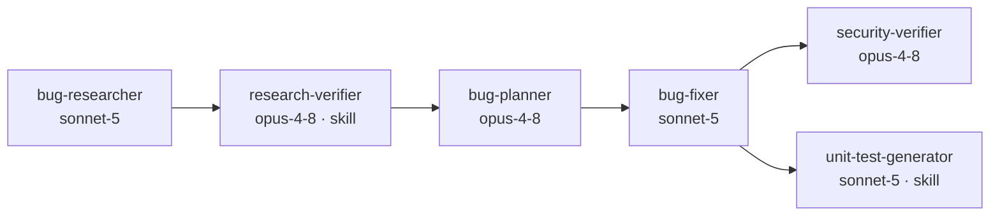
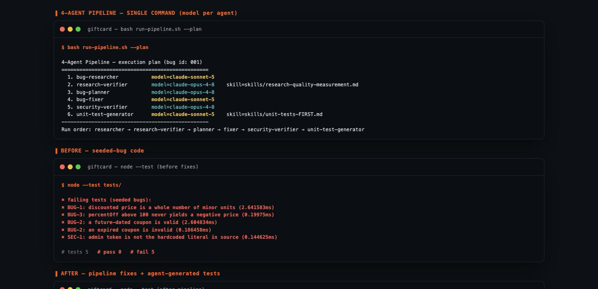
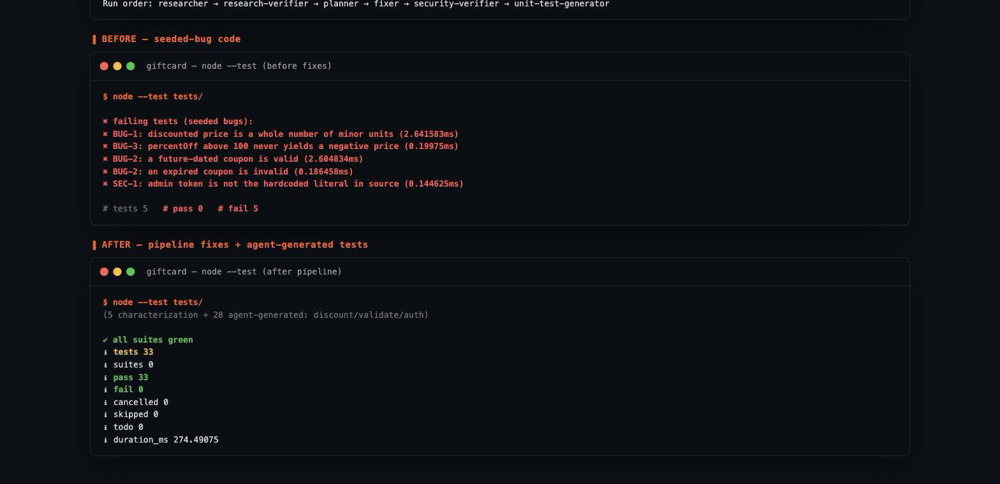
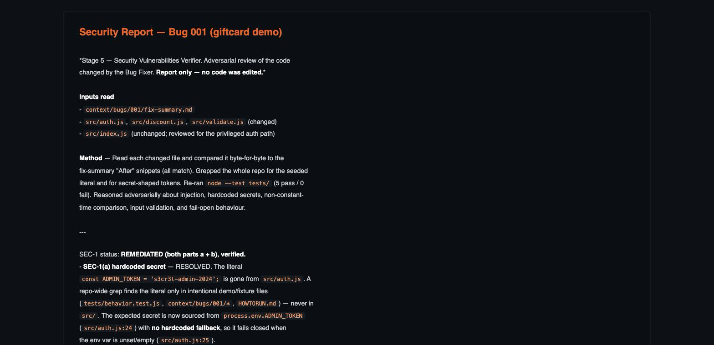
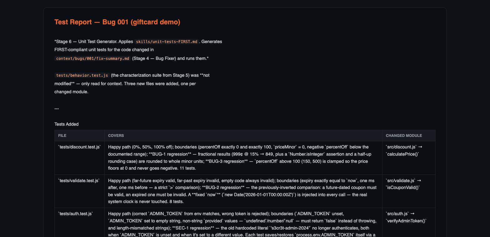

# 🤖 Homework 4 — 4-Agent Bug-Fix Pipeline

> **Student Name**: Andrii Melnyk (@melnykandria-ops)
> **Date**: 2026-07-29
> **AI Tools**: Claude Code — a 6-stage agent pipeline (models per agent) + 2 custom skills

---

## 📋 Overview

A **single-command** pipeline of AI agents that researches, verifies, fixes,
security-reviews and tests bugs in a small sample app. Each agent has an
**explicit model chosen for its task**, and two stages are governed by **custom
skills**. The pipeline operates on a real mini-app (`src/`) seeded with 3 logic
bugs + 1 security issue and drives it from **5 failing tests → 33 passing**.



## ▶️ Run it (one command)

```bash
cd homework-4
npm run pipeline            # bash run-pipeline.sh — runs every agent in order
bash run-pipeline.sh --plan # preview the ordered stages + per-agent model
```

`run-pipeline.sh` reads each agent's frontmatter, runs it via `claude -p` with
the declared `--model`, and auto-loads the agent's skill as an appended system
prompt. Full run/test details in [HOWTORUN.md](HOWTORUN.md).

## 🧩 The agents & the model-per-agent rationale

| # | Agent | Model | Why this model |
|---|-------|-------|----------------|
| 1 | `bug-researcher` | **claude-sonnet-5** | High-volume reading/grepping across a small codebase — capable but not deep-reasoning work; fast/cheaper fits |
| 2 | `research-verifier` *(Task 1)* | **claude-opus-4-8** | Verification is the pipeline's trust anchor; catching a stale line ref or 1-char snippet mismatch needs the strongest reasoning |
| 3 | `bug-planner` | **claude-opus-4-8** | The plan is executed verbatim by the cheaper fixer; getting before/after and ordering right up front prevents rework |
| 4 | `bug-fixer` *(Task 2)* | **claude-sonnet-5** | Applying an already-decided explicit plan is routine mechanical editing → the "cheaper model for routine fixes" split |
| 5 | `security-verifier` *(Task 3)* | **claude-opus-4-8** | Adversarial reasoning about attack surface; false negatives are expensive → strongest model |
| 6 | `unit-test-generator` *(Task 4)* | **claude-sonnet-5** | Test scaffolding from an explicit spec is routine/high-throughput → the "cheaper model for test scaffolding" split |

**Pattern:** *think/verify* stages (verify, plan, security) run on **Opus 4.8**;
*produce/apply* stages (research, fix, tests) run on **Sonnet 5**.

## 🛠️ Custom skills

- [`skills/research-quality-measurement.md`](skills/research-quality-measurement.md) *(Task 1.2)* — a 4-level rubric (R1–R4) the **research-verifier** uses to grade research quality in `verified-research.md`. *(This run scored **R4 — Verified-Complete**.)*
- [`skills/unit-tests-FIRST.md`](skills/unit-tests-FIRST.md) *(Task 4.2)* — the **FIRST** principles (Fast, Independent, Repeatable, Self-validating, Timely) the **unit-test-generator** must satisfy; enforced via a checklist in `test-report.md`.

## 🐞 The sample app & seeded issues *(Task 5)*

A tiny giftcard/discount CLI in [`src/`](src/) (Node.js, **zero dependencies**, `node:test`):

| ID | File | Issue |
|----|------|-------|
| BUG-1 | `src/discount.js` | discounted price not rounded → fractional cents |
| BUG-2 | `src/validate.js` | inverted expiry check → expired coupons pass |
| BUG-3 | `src/discount.js` | `percentOff > 100` → negative price (no clamp) |
| SEC-1 | `src/auth.js` | hardcoded admin secret + non-constant-time `===` compare |

Seeded issues documented in [`context/bugs/001/bug-context.md`](context/bugs/001/bug-context.md).

## 📦 Pipeline outputs (real run, committed)

All produced by an actual pipeline run with Claude agents:

- [`research/codebase-research.md`](context/bugs/001/research/codebase-research.md) · [`research/verified-research.md`](context/bugs/001/research/verified-research.md) (**R4**)
- [`implementation-plan.md`](context/bugs/001/implementation-plan.md) · [`fix-summary.md`](context/bugs/001/fix-summary.md) (all edits applied, tests green)
- [`security-report.md`](context/bugs/001/security-report.md) (**SEC-1 REMEDIATED**; 4 LOW/INFO residuals, none blocking)
- [`test-report.md`](context/bugs/001/test-report.md) + generated [`tests/discount.test.js`](tests/discount.test.js), [`tests/validate.test.js`](tests/validate.test.js), [`tests/auth.test.js`](tests/auth.test.js) (28 new tests, FIRST-compliant)

> ℹ️ Nested `claude -p` could not authenticate in the build environment, so the
> pipeline stages for this run were executed as Claude agents via an
> orchestration workflow (same agent definitions, same per-agent models, same
> skills). `run-pipeline.sh` is the reproducible single-command entry on any
> machine with an authenticated `claude` CLI.

## 📸 Screenshots

**Pipeline (single command, model per agent) + before state (5 failing tests):**



**Before → after — fixes applied, 33 tests green:**



**Security scan — SEC-1 remediated:**



**Unit tests generated for the changed code:**



---

*Completed for the GenAI & Agentic AI for Software Engineering course.*
